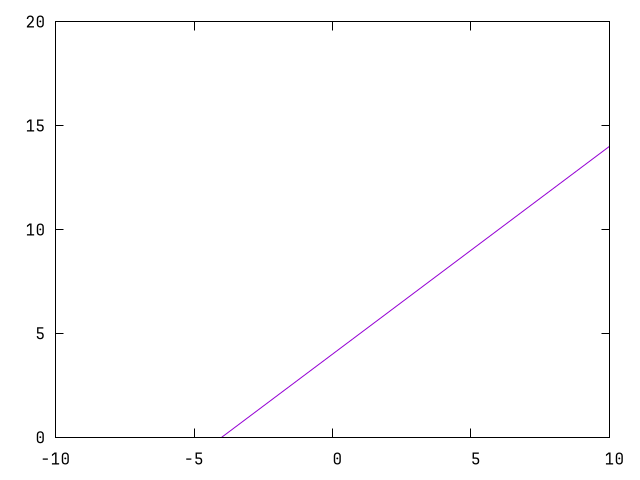
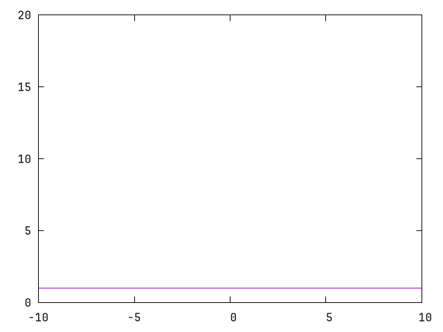
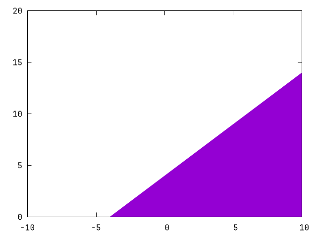
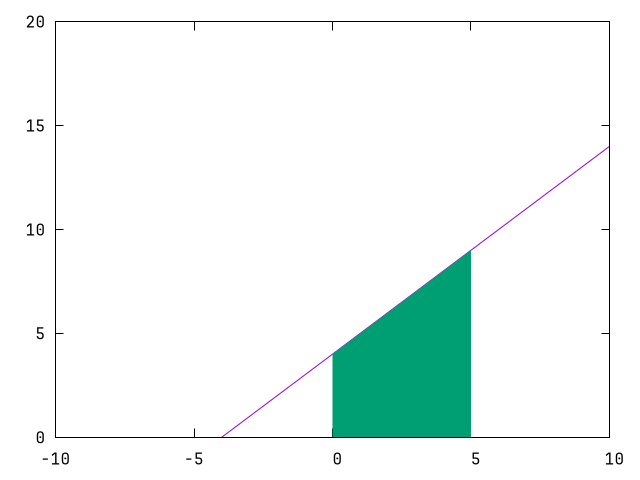
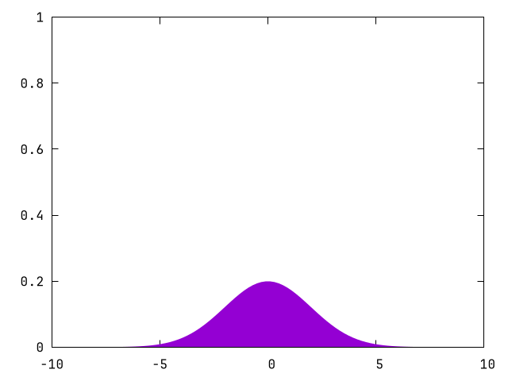
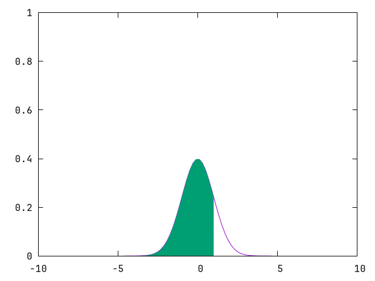

:PROPERTIES:
:ID:       f0b0af67-dad8-4ed9-992f-ee360fa4565e
:END:
#+title: Calculus in a few pages
#+TYPST: #set image(width: 60%)

There are three fundamental concepts in calculus. That's it! So if you
know these three concepts, other math concepts that depend upon these concepts
should be possible to learn. For example, the [[https://en.wikipedia.org/wiki/Z-test][Z-test]] and the [[https://en.wikipedia.org/wiki/Chi-squared_test][Chi-squared]] test
both depend upon *integration*, one of the three concepts, to work.

Calculus is a hard /class/, not a hard /subject/. The class is hard because the fundamental
concepts are padded with lots of difficult algebra. There is usually lots of memorization of formulas and
procedures to solve specific equations. Luckily, we don't have to worry about any of that.

So, to get right into it, here are the three concepts:
1. Limits (sometimes taught in pre-calc)
2. Derivation
3. Integration

* function review

A function is a set of operations that takes input(s) and returns an output. These are an *extremely important* computer
science concept, but are also present in math.

In math, a function is defined like so:

\begin{equation}
f(x) = x+4
\end{equation}

This function \(f\) takes 1 input and returns that input plus 4.

In R, the same function can be defined like so:

#+begin_src R 

f <- function(x){
  x+4
}

f(5) # returns 9
f(3) # returns 7
#+end_src

Feel free to give it a try!

* Limits

With functions, there are certain values that can't be plugged in to the function. For example, \(\infty\). In math,
\(\infty\) is not a number, so \(\infty + 4\) doesn't really mean anything. Instead, to define what happens in this
case, there is a concept called the *limit*. In essence, it means to evaluate a function as you get infinitely close to
a chosen value.

So, while we can't do \(f(\infty)\), we /can/ do \[ \lim_{x \rightarrow \infty} f(x) \]. This
is basically saying, as the values for x get bigger and bigger, what happens to the output?
In this case, the answer is \[\lim_{x \rightarrow \infty} f(x) = \lim_{x \rightarrow \infty} x + 4 = \infty\]. This should hopefully make sense, \(4 + \infty\) is still \(\infty\).

Here is a 20 minute video on just limits if you want: [[https://www.youtube.com/watch?v=G4LOp6PhBKM][What is a limit in calculus?]]
#+typst: #pagebreak()
* Derivation (derivatives)
The reason we need to know about limits is that derivatives are defined as this: \[L=\lim_{h \to 0}\frac{f(a+h)-f(a)}h\]

Notice the limit notation. \(a\), represents all points in the /domain/ of \(f(x)\). So any valid value for \(x\) can be plugged
in for \(a\). Luckily, you don't have to memorize this (woohoo!). Instead, I'll describe what this formula means, then I'll
show a trick to do this formula without any algebra.

So what does this formula give you? Take our equation from before \(f(x) = x+4)\. The plot of this line might look like
this:

#+begin_src gnuplot :file 20251016091638-calculus_in_a_page/xplus4.png :exports results
set yrange [0:20]
plot x + 4
#+end_src

#+caption: The plot of f(x) = x+4
#+name: fig:figure1
#+RESULTS:

The plot of the derivative, however, looks like this:

#+begin_src gnuplot :file 20251016091638-calculus_in_a_page/derivative.png :exports results
set yrange [0:20]
plot 1
#+end_src

#+caption: The plot of the derivative of f(x) = x+4
#+name: fig:figure2
#+RESULTS:

If you looked carefully, you might have noticed that the line in [[fig:figure2]]
is equal to the /slope/ of the line in [[fig:figure1]]. This is what the "derivative" of
a function means. It is just another function (we'll call it \(f'(x)\)) where any value
that is plugged in will return the slope of the value returned by \(f(x)\).

So if we remember how to calculate slope using \(y=mx+b\), you'll notice that \(m\), the slope, is 1 when \(y=x+4\).

In summary, the derivative is just a way to calculate the slope of any point on a function line.

So, how do we calculate the derivative without doing algebra?

If you have a function that looks like this:

\[f(x) = x^2\]

Then the derivative would look like this:

\[f(x) = 2x\]

So, to break this down, the exponent (2) is multiplied by the term (x), then the exponent is subtracted by 1.

In the case of multiple terms, as in a polynomial, this treatment is done for each term.

\[f(x) = x^2 + 2x + 5 \rightarrow 2x + 2 + 0  = f'(x)\]

Notice that the 5 evaluates to 0 because there is no variable (x). This is important, because
information is lost between a function and its derivative!

That it!

Here is a video from Khan academy with the basic concept (7 minutes): [[https://www.youtube.com/watch?v=N2PpRnFqnqY][Derivative as a concept]]

* Integration (Integrals)
We're almost done with calculus!

An Integral is just a derivative in reverse. It is really that simple!

But remember, we lost information when doing the derivative, and there isn't a way to get
that info back. So if the derivative of \(f(x) = x+4\) is \(1\), then when we do the integral,
we have no way of knowing that the 4 existed. So the integral of \(1\) is \(x + C\). \(C\) is
just a "constant", or any value that doesn't contain a variable.

Integrals are written like this:

\[ \int f(x) dx \]

While integrals are just a reverse derivatives, an integral of a function is equal to the
area under the line given by the original function. For example, the integral of \(x+4\)
actually returns the solid area of this graph:

#+begin_src gnuplot :file 20251016091638-calculus_in_a_page/area.png
set yrange [0:20]
plot x + 4 with filledcurves x1

#+end_src

#+RESULTS:

If we wanted to calculate the area of the region between 0 and 5, we can use a *definite* integral.

With a definite integral, we ignore \(C\), and plug in a value for x twice, once with the big value (5) and once with the small value(0). These terms are then
subtracted.

\[\int^5_0 x + 4 dx \rightarrow \frac{1}{2}(5)^2 - \frac{1}{2}(0)^2 \rightarrow  12.5 \]

This gives us the area shown below:

#+begin_src gnuplot :file 20251016091638-calculus_in_a_page/area2.png

set yrange [0:20]
plot x+4, [0:5] x + 4 with filledcurves x1 

#+end_src

#+RESULTS:

If you didn't catch on, the trick to doing an integral without any algebra is to just do the derivative trick in reverse. Add one to the exponent and divide the term by that exponent.

In summary, integrals are reverse derivatives and can be used to find the area under the line given by a function.

* Connections to statistics

So how does this relate to statistics? Well, random data usually fits some sort of distribution. For example, human heights usually fit into
what is called the "normal" distribution. What this means is that if you were to take all the humans in the world and plot their heights on
a bar chart, it would look something like this:

#+begin_src gnuplot :file 20251016091638-calculus_in_a_page/normal.png
sigma = 2
mean = 0

set yrange [0:1]
f(x) = (1/(sqrt(2 * pi * (sigma**2)))) * exp(-((x - mean)**2)/(2 * (sigma**2)))

plot f(x) with filledcurves x1

#+end_src

#+RESULTS:

The equation of the line (not the filled in area) for this distribution looks like this:

\[ f(x)={\frac {1}{\sqrt {2\pi \sigma ^{2}}}}e^{-{\frac {(x-\mu )^{2}}{2\sigma ^{2}}}}\]

This equation is big and scary, but notice how there are now two extra symbols \(\mu\), the mean
and \(\sigma\), the standard deviation. R has built in functions for both of these: =mean()= and
=sd()=.

Here is an interactive normal distribution so you can see how these values change how the normal distribution
looks: [[https://istats.shinyapps.io/NormalDist/][Interactive Normal Distribution]]. Fyi, it is written in R!

Say you wanted to calculate the probability that someone has a height less than 6 feet.

The way you would normally do this is through a Z table. So say that the average height is 5 feet and
the standard deviation is 1 foot. The Z score is given by this formula:

\[Z = \frac{X-\mu}{\sigma} = \frac{6 - 5}{1} = 1 \]

You would take this Z value and look up the value in a /cumulative Z table/. This would then
give you your probability. Here is how you might do it in R

#+begin_src R

mean <- 5
x <- 6
standard_deviation <- 1

Z <- (x - mean)/standard_deviation

pnorm(Z) # cumulative Z table lookup
#+end_src

#+RESULTS:
: 0.841344746068543

This gives us a probability of 84 percent. P values are often calculated in a similar way. Instead
of an observation like "the probability of a height less than 6 feet", it is the probability of a hypothesis
being true. So something like "all humans have a height less than 6 feet" has a probability of 84% of being true.
This is a P value of \((1-0.84) = 0.16\), which is pretty bad. medicine usually uses a p value cutoff of 0.01,
which is a 99% probability that their hypothesis is true.

But how does this relate to calculus? Well, something that always frustrated me was understanding
what the Z table was actually giving me. It turns out, that the Z table is actually an *integration* of
the equation for a normal distribution! Specifically, a cumulative Z table, like the one we used, is a definite
integral from \(-\infty\) to the Z value. So when you look up the value 1, what you're actually doing is finding
the area of the solid part of this plot:

#+begin_src gnuplot :file 20251016091638-calculus_in_a_page/ztable.png :export results
sigma = 1
mean = 0

f(x) = (1/(sqrt(2 * pi * (sigma**2)))) * exp(-((x - mean)**2)/(2 * (sigma**2)))
set key off
plot f(x), [-10:1] f(x) with filledcurves x1
#+end_src

#+RESULTS:

It is important to note that this only works if the data actually fits the normal/Gaussian distribution.
So you aren't just gambling that your hypothesis is true, but also that your data fits your chosen distribution.

You might be wondering, if the Z table is just an integration, why do we need a table? can't we just do the integral
and use that formula? The answer is that it is actually impossible to
symbolically integrate the formula for the normal distribution. So no, you couldn't even do the algebra even if you wanted to!

Instead, the computer estimates the answer through
a technique called [[https://en.wikipedia.org/wiki/Numerical_integration][Numerical Integration]]. The Z table is just a table of pre-computed estimations. Statistics
is full of these integrals. So it isn't even useful to learn the algebraic techniques, because
the computer doesn't use them anyway.

* The Physics connection

Calculus is also deeply connected to physics. Velocity, for example, is actually the derivative of position.
Acceleration is the derivative of velocity.

So, if we assume a constant acceleration due to gravity, we can actually get the equation for position using integrals!

- acceleration = \(f(x) = 9.8\)
- velocity = \(f(x) = 9.8x + C = 9.8x + 1\): C is our initial velocity (we'll set it to 1)
- position = \(f(x) = 4.9x^2 + 1x + C\): C is our initial position

Pretty neat!
